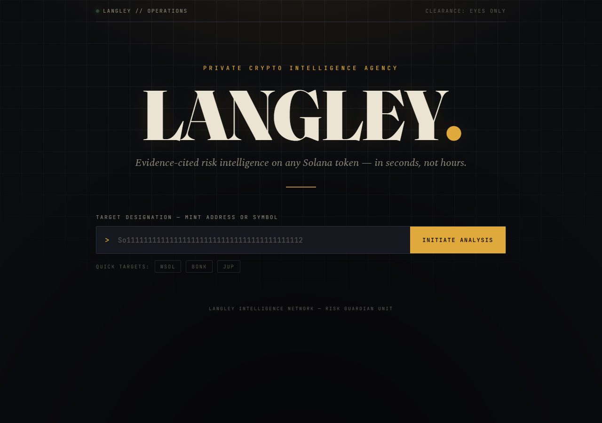

<div align="center">

# 🛰️ Langley

### Your Private Crypto Intelligence Agency

**AI agent that flags rug pulls, honeypots, and scam tokens on Solana — with evidence-cited verdicts, in seconds.**




</div>

## About

**Langley** is a multi-agent crypto-intelligence system. Instead of a single scanner, it's designed as a team of specialist AI agents that monitor on-chain data, market activity, and (soon) social signals, then collaborate and cross-verify before producing ranked, evidence-cited insights.

The first and highest-stakes agent — the **Risk Guardian** — is fully built: give it a Solana token (mint address or symbol) and it fetches live market + contract data and returns a structured risk verdict where **every claim cites the exact data field it came from**. If the evidence is insufficient, it **abstains** rather than guessing — because for a risk tool, a confident wrong "safe" is the only unforgivable error.

This repo is built **risk-first and eval-driven**: prove one agent is genuinely trustworthy (measured on a real, held-out dataset) before adding breadth.

## Key Features

- **🔎 Evidence-cited verdicts** — every risk signal references a concrete data field (`liquidity_usd`, `top10_holder_pct`, …); no hand-wavy conclusions.
- **🧱 3-layer trust design** — a strict prompt, schema validators, and an LLM-free deterministic gate that can override the model toward *abstain* / *unsafe* — never toward a confident wrong "safe".
- **🛰️ Multi-source intelligence** — DexScreener (market) + Helius (contract: mint/freeze authority, holder concentration) merged behind one provider interface; degrades gracefully if a source fails.
- **🧪 Honestly evaluated** — measured on a **real, outcome-verified, held-out** dataset (tokens labeled by what actually happened to them), not cherry-picked demos.
- **🖥️ Bespoke demo UI** — a "declassified dossier" front end: paste a token, watch the scan, get a stamped verdict with an animated confidence meter.
- **🧩 Extensible by design** — new chains/data sources are a new provider; new agents copy the proven pattern.

## Screenshots

| Verdict: CLEARED | Verdict: FLAGGED |
|---|---|
|  |  |

## How It Works

```
            ┌──────────── DexScreener ─────────────┐  (market: price, liquidity, age, trading)
   token ──►│                                       ├──► MarketSnapshot ──► Risk Guardian (GPT-4o)
            └──────────── Helius ──────────────────┘  (contract: authorities, holder concentration)
                                                              │
                                              evidence-cited TokenRiskReport
                                                              │
                                          Deterministic safety gate (no LLM)
                                          • forces UNSAFE on hard rug/honeypot patterns
                                          • forces ABSTAIN if a cited field isn't in the data
                                          • never upgrades toward a confident "safe"
                                                              │
                                      verdict · confidence · cited evidence
```

**The trust model (defense-in-depth):**
1. **Prompt** — must cite evidence; abstain under uncertainty; context-aware (a signal that's alarming on a new token can be normal on an established one).
2. **Schema validators** — a conclusive verdict must carry evidence; an abstain must carry a reason.
3. **Deterministic gate** — an LLM-free pass that independently checks every cited field exists, enforces coverage rules, and only ever moves the verdict in the *safer* direction.

## Results (honest, held-out)

Measured by running the live agent on a **held-out test set of real Solana tokens it was never tuned on**, labeled by their actual outcome (survived vs. died/abandoned):

| Metric | Score |
|---|:---:|
| **Fatal errors** (a scam called "safe") | **0** |
| **False positives** (a healthy token called "unsafe") | **0** |
| **Precision** (unsafe) | **1.00** |
| **Recall** (unsafe) | **0.89** |
| **F1** | **0.94** |

> Honest caveats: the dataset is small (held-out test of 18 tokens) and memecoin-skewed, labels are rubric-based (not yet independently audited), and GPT-4o has mild run-to-run variance. These are first real numbers, not a production guarantee — see [`docs/architecture.md`](docs/architecture.md).

## Tech Stack

| Layer | Choice |
|---|---|
| Agent framework | OpenAI Agents SDK (GPT-4o) |
| Data | DexScreener (market) · Helius (Solana contract) |
| Core | Python 3.12 · Pydantic v2 · httpx · tenacity · structlog |
| API / UI | FastAPI · hand-crafted single-page UI (no build step) |
| Tooling | uv workspace · Ruff · Pyright (strict) · pytest |

## Getting Started

```bash
# 1. Install (uv provisions Python 3.12 + all deps)
uv sync

# 2. Configure keys
cp .env.example .env      # add OPENAI_API_KEY (and optionally a free Helius key)

# 3. Run the demo UI
uv run langley-api        # → http://127.0.0.1:8000

# 4. Or use the CLI
uv run python -m langley_risk "So11111111111111111111111111111111111111112"

# 5. Quality gates + evals
uv run ruff check . && uv run pyright && uv run pytest -m "not live"
uv run python -m langley_risk.evals.run            # free baseline eval
uv run python -m langley_risk.evals.run_v3 test.jsonl   # held-out eval (live)
```

To enable contract enrichment, set `LANGLEY_RISK_PROVIDER=composite` + `LANGLEY_RISK_HELIUS_API_KEY` (free tier works) in `.env`.

## Project Status

| Agent | Status |
|---|---|
| **Risk Guardian** (`packages/langley_risk`) | ✅ Built, evaluated, calibrated |
| On-Chain Forensics · Narrative Scout · Sentiment · Opportunity Simulator · Synthesis · Storyteller | 🅿️ Planned (placeholder homes) |
| `apps/api` (demo API + UI) | ✅ Built |
| `apps/web` (Next.js) | 🅿️ Planned |

See [`docs/architecture.md`](docs/architecture.md) for the full vision and the risk-first rationale, and [`CLAUDE.md`](CLAUDE.md) for the engineering guide.

## Disclaimer

Langley produces **risk signals, not financial advice.** Verdicts are derived from public market and on-chain data and may be incomplete or wrong. Always do your own research before transacting. Nothing here is a recommendation to buy or sell any asset.

## License

TBD (MIT recommended).

---

<div align="center">
<sub>Built as a showcase of production-grade multi-agent AI engineering — risk-first, eval-driven, honestly measured.</sub>
</div>
