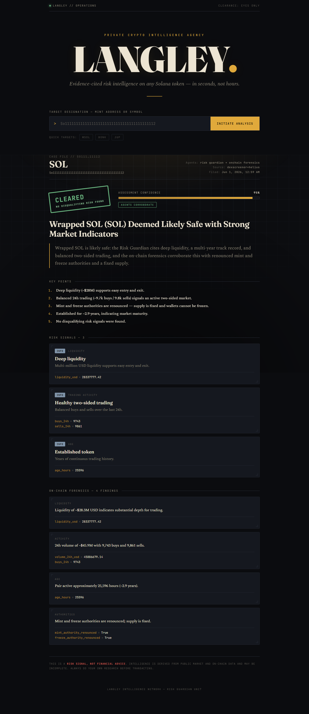
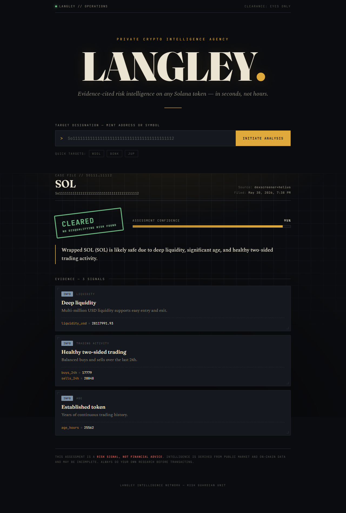
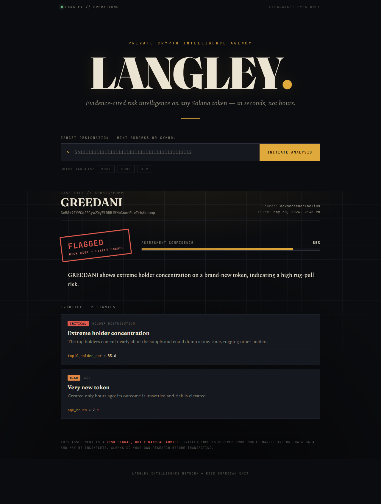

<div align="center">

# 🛰️ Langley

### Your Private Crypto Intelligence Agency

**A team of AI agents that checks whether a Solana crypto token is a scam — and explains its answer with evidence, in seconds.**




</div>

---

> **📖 This README is also an interview guide.** It's written so that if someone asks *"Can you walk me through this project?"*, you can read top-to-bottom and confidently explain what it does, why, how it's built, and the decisions behind it — in plain language.

---

## 1. What does this project do? (The 30-second version)

Langley looks at a Solana crypto token (you give it a token address or symbol) and tells you **how risky it is** — for example, is it a likely scam, or does it look legitimate? It returns a short report with a clear verdict, a confidence score, and **the exact data behind every claim**.

The twist: instead of one big program, Langley works like a small **intelligence agency** — a team of specialist AI agents:

- **The Risk Guardian** (the *judge*) — decides: safe, caution, unsafe, or "not sure."
- **On-Chain Forensics** (the *investigator*) — reports neutral facts about the token (no opinion).
- **The Synthesis Orchestrator** (the *editor*) — runs both, then combines their work into one clear briefing.

You interact with it through a simple web page (a "classified dossier" themed UI).

---

## 2. What problem does it solve?

Crypto — especially cheap Solana "memecoins" — is full of scams:

- **Rug pull:** the creators drain all the money out, leaving your coins worthless.
- **Honeypot:** you can *buy* the coin but the code won't let you *sell* — your money is trapped.

Regular people lose real money to these, and checking a token by hand is slow and needs expert knowledge. Langley does that homework in seconds and explains its reasoning.

**The guiding rule of the whole project:** the worst possible mistake is telling someone a scam is *"safe."* So everything is designed to **rather say "I'm not sure" than guess** — because a confident wrong "safe" is the one unforgivable error.

---

## 3. The big picture (architecture)

Langley is a **monorepo** (one repository holding several small, independent packages):

```
packages/
  langley_risk/        ← Risk Guardian  (the judge: gives a verdict)
  langley_onchain/     ← On-Chain Forensics (the investigator: neutral facts)
  langley_synthesis/   ← Synthesis Orchestrator (fuses the two)
apps/
  api/                 ← FastAPI backend + the demo web page
docs/                  ← architecture notes + screenshots
```

Every agent follows the **same simple assembly line**, which makes the codebase easy to learn once and reuse:

```
data providers  →  tools  →  the agent (AI)  →  service  →  safety gate
 (get the data)  (hand it    (reasons &       (runs it)   (double-checks &
                 to the AI)   writes a report)             can override the AI)
```

### The 3-layer "trust" design (the most important idea)

To make sure the AI never produces a confident wrong "safe," there are **three independent safety layers**:

1. **The prompt** — the AI is instructed to cite evidence for every claim and to say "not sure" when data is missing.
2. **Schema checks** — the report's structure is validated: a real verdict *must* carry evidence; an "abstain" *must* carry a reason.
3. **A deterministic safety gate** — a plain, non-AI piece of code that re-checks the AI's answer and can **override it** (e.g. force "unsafe" on an obvious scam pattern, or force "not sure" if the AI cited data that wasn't actually there). It only ever moves the answer in the *safer* direction.

> Think of it like a newsroom: the reporter (AI) writes the story, but a fact-checker (the gate) can pull or correct it before it's published.

---

## 4. Technologies used — and *why*

| Technology | What it's for | Why we chose it |
|---|---|---|
| **Python 3.12** | The whole backend | Best ecosystem for AI + data work; modern typing |
| **OpenAI Agents SDK + GPT-4o** | Builds the AI agents | Gives agents *tools* (to fetch data) and *structured output* (clean JSON, not loose text) out of the box |
| **Pydantic** | Data "contracts" | Forces every report into a strict, validated shape — no surprises |
| **DexScreener API** | Market data (price, liquidity, trading) | Free, no key needed — the token's "outside view" |
| **Helius API** | Contract data (who can mint coins, holder concentration) | Sees *inside* the token's code — the danger most scams hide; free tier available |
| **FastAPI** | The demo's web server | Fast, async, automatic API docs; tiny amount of code |
| **Plain HTML/CSS/JS** | The demo web page | No heavy build step = fast to ship, and full control over a distinctive design |
| **uv** | Installs & manages everything | Extremely fast; manages the whole multi-package workspace |
| **Ruff + Pyright + pytest** | Code quality | Linting, strict type-checking, and tests — kept green at every step |

**Plain-English analogy for the data sources:** DexScreener shows the restaurant from *outside* (is it busy?). Helius lets us look in the *kitchen* (are the ingredients safe?). Real poison hides in the kitchen — which is why we added Helius.

---

## 5. How the main features work

### The Risk Guardian (the judge)
1. Fetches the token's data (market + contract).
2. Reasons over it and writes a verdict — **but every risk it names must point to a real data field and value** (e.g. `liquidity_usd = 12`). No evidence → it isn't allowed to claim it.
3. If the data is too thin to judge, it **abstains** ("not sure") instead of guessing.
4. The **safety gate** then double-checks and can override it.

### On-Chain Forensics (the investigator)
- Produces a **neutral, factual profile** (liquidity, holders, authorities, activity, age) — and is explicitly *not allowed* to say "safe" or "unsafe." It just reports facts. This keeps it from overlapping with the judge.

### The Synthesis Orchestrator (the editor)
- Runs the judge and the investigator **at the same time**, then a third AI **fuses** their outputs into one briefing: a headline, whether the two agents agree, ranked key points, and both sets of evidence.
- **Crucial safety rule:** the final safe/unsafe verdict is **copied directly from the Risk Guardian** — the fusing AI is *structurally unable* to change it. The editor can only narrate, never overrule.

---

## 6. The request/response flow (what happens on one click)

```
You type a token → the web page → POST /api/intelligence (FastAPI)
        │
        ├─ runs Risk Guardian  ─┐   (both run at the same time)
        └─ runs On-Chain Forensics ┘
                       │ (each fetches DexScreener + Helius, reasons, self-checks via its gate)
                       ▼
            Synthesis fuses them → IntelligenceReport (verdict carried verbatim from the judge)
                       ▼
       JSON sent back → the page renders the "dossier" (verdict stamp, briefing, key points, evidence)
```

In words: one click hits one endpoint; that endpoint runs two specialist agents in parallel, fuses their results with a third agent, and returns a single structured report that the page turns into a styled dossier. A rate limiter protects the endpoint so a public demo can't burn through the API budget.

---

## 7. Key technical decisions & trade-offs

- **Build risk-first, one agent at a time.** We fully proved the highest-stakes agent (the judge) before adding others — instead of half-building all seven. *Trade-off:* slower to "look complete," but each piece is trustworthy.
- **A deterministic gate can override the AI.** We trust *plain code rules* over AI cleverness for the final safety call. *Trade-off:* a bit more code, but the AI can never silently produce a wrong "safe."
- **The orchestrator copies the verdict verbatim.** The fusing AI writes the story but cannot touch the safe/unsafe decision. *Trade-off:* less "creative" synthesis, far more trustworthy.
- **Swappable data sources behind one interface.** We started with free DexScreener, then added Helius later with **zero changes to the agents**. *Trade-off:* a little abstraction up front, easy expansion forever.
- **Honest evaluation with a held-out test set.** We measure on real tokens the agent was never tuned on. *Trade-off:* the real score is lower and humbler than a demo number — but it's true.
- **Reuse by dependency (for now).** New agents *import* the first package rather than sharing a common library yet. *Trade-off:* a little duplication; the clean fix (a shared `langley_core` package) is noted for later.

---

## 8. Challenges faced — and how they were solved

These are great "tell me about a hard problem" stories:

1. **"Our perfect scores were lying to us."** Early tests on made-up data scored 100%. So we built a **real, outcome-verified dataset** (labeling tokens by what *actually happened* to them) and tested on a *held-out* set. The honest score was **F1 ≈ 0.63** — and it revealed the agent was **over-warning on healthy tokens**.
   - **Fix:** we found the cause (it treated "holder concentration" as a scam signal, but that number normally includes exchange/pool wallets), tuned the instructions on a *training* split, and re-measured once on the blind test → **F1 ≈ 0.94, zero fatal errors.**

2. **"The real danger was invisible."** A random sample of real tokens had *no* scams detectable from market data alone — the danger lived in the contract (e.g. the creator can still print unlimited coins).
   - **Fix:** added the **Helius** data source so the agent can finally "see inside the kitchen."

3. **Free-tier API surprises.** Helius's free plan rejected our bundled requests, and one of its calls was often overloaded.
   - **Fix:** send the calls separately, and make the heavy one **best-effort** (still return the important data if it fails).

4. **A subtle safety bug, caught by review.** An automated "adversarial review" found the fusing AI could imply "looks fine" in its wording even when the verdict was "unsafe."
   - **Fix:** removed the option that let it contradict the verdict, and made the headline always lead with the verdict's stance.

5. **A self-inflicted gate bug.** The safety gate was downgrading a correctly-flagged "unsafe" to "not sure" just because one cited field was missing — moving in the *wrong* (less safe) direction.
   - **Fix:** the gate now keeps a well-evidenced "unsafe" and only drops the bad citation.

6. **Plumbing gotchas.** Things like the `.env` file not reaching the AI library, and two packages having same-named test files — each found and fixed cleanly (e.g. switching the test importer mode).

> A recurring theme: **we kept an automated reviewer adversarially checking each new piece before committing**, which repeatedly caught real bugs early.

---

## 9. Possible future improvements

- **Finish the team.** Four more planned agents (Narrative Scout, Sentiment, Opportunity Simulator, Storyteller). These need new data sources (e.g. the X/Twitter API).
- **A shared core package** (`langley_core`) so agents share common code instead of duplicating it.
- **A bigger, human-reviewed dataset** + "shadow mode" (log live verdicts, then check weeks later what actually happened) — the safe way to keep improving without risking anyone's money.
- **Calibrated confidence** — make "85%" actually mean right ~85% of the time.
- **Deploy a public demo URL**, and add **multi-chain support** (Ethereum, Base) — which is just *new data providers* behind the existing interface.

---

## 10. Getting Started

```bash
# 1. Install (uv provisions Python 3.12 + all dependencies)
uv sync

# 2. Add your keys
cp .env.example .env      # add OPENAI_API_KEY (and, optionally, a free Helius key)

# 3. Run the demo (multi-agent UI)
uv run langley-api        # → open http://127.0.0.1:8000

# 4. Or use the command line
uv run python -m langley_synthesis "So11111111111111111111111111111111111111112"   # full team
uv run python -m langley_risk "<mint-or-symbol>"                                    # just the judge

# 5. Quality gates + evaluations
uv run ruff check . && uv run pyright && uv run pytest -m "not live"
uv run python -m langley_risk.evals.run               # free baseline eval
uv run python -m langley_risk.evals.run_v3 test.jsonl # honest held-out eval (needs OpenAI key)
```

For contract-level depth, set `LANGLEY_RISK_PROVIDER=composite` + `LANGLEY_RISK_HELIUS_API_KEY` in `.env`.

---

## 11. Project status

| Component | Role | Status |
|---|---|---|
| Risk Guardian (`langley_risk`) | The judge — gives the verdict | ✅ Built, evaluated, calibrated |
| On-Chain Forensics (`langley_onchain`) | The investigator — neutral facts | ✅ Built |
| Synthesis Orchestrator (`langley_synthesis`) | The editor — fuses the team | ✅ Built |
| Narrative · Sentiment · Simulator · Storyteller | Future specialists | 🅿️ Planned |
| `apps/api` (demo API + UI) | The front door | ✅ Built (multi-agent) |

More screenshots — the single-agent verdict views:

| Verdict: CLEARED | Verdict: FLAGGED |
|---|---|
|  |  |

See [`docs/architecture.md`](docs/architecture.md) for the full vision and [`CLAUDE.md`](CLAUDE.md) for the engineering guide.

---

## Disclaimer

Langley produces **risk signals, not financial advice.** Verdicts come from public market and on-chain data and can be incomplete or wrong. Always do your own research before transacting.

<div align="center">
<sub>Built as a showcase of production-grade multi-agent AI engineering — risk-first, eval-driven, honestly measured.</sub>
</div>
